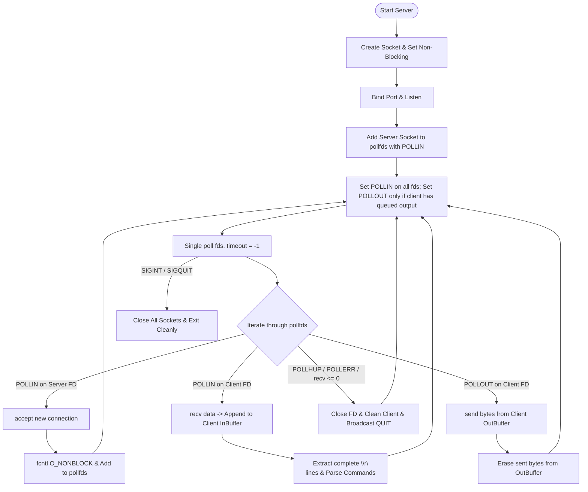
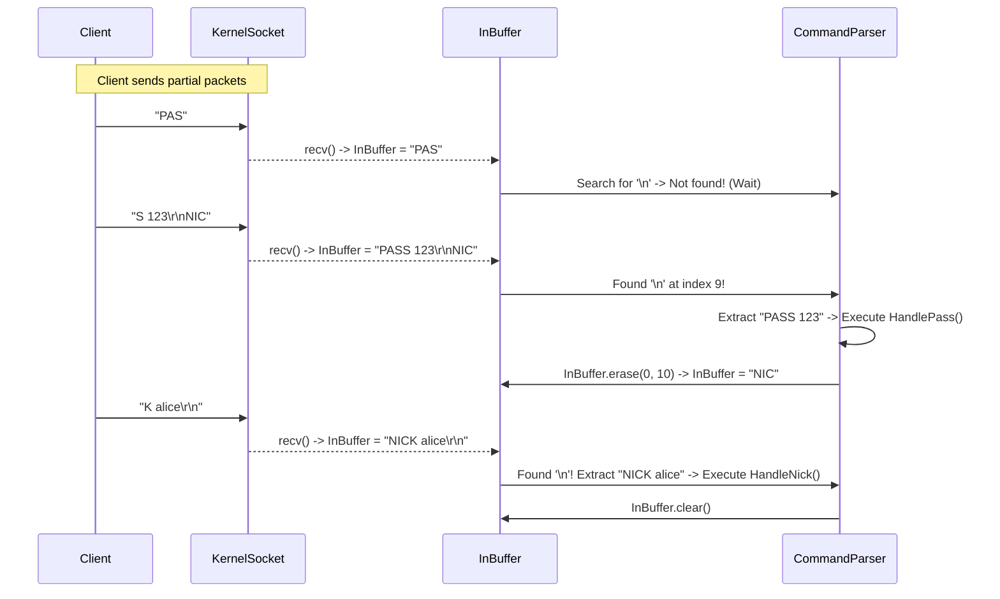
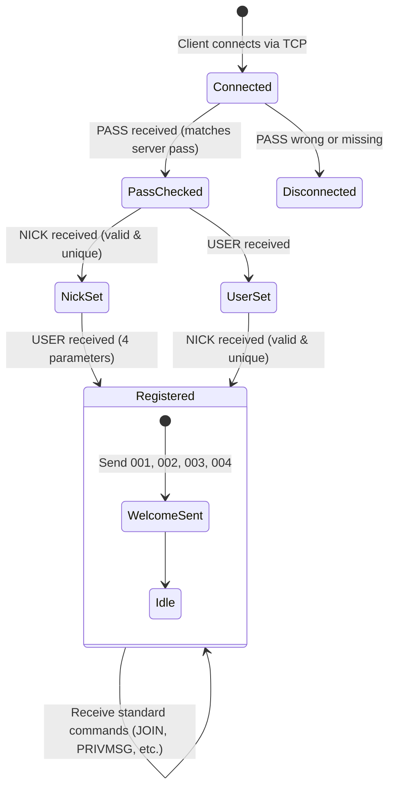
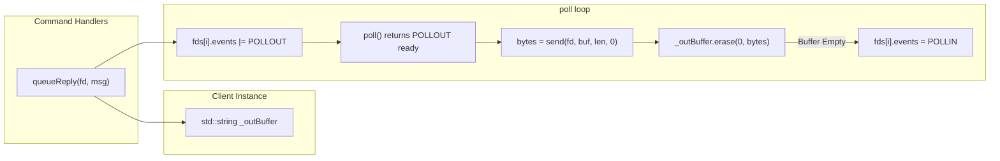

# Complete Guide: `ft_irc` Server & Client Architecture (42 Project)

This document is your **complete study guide, codebase audit, evaluation sheet alignment, and implementation roadmap** for your half of the `ft_irc` project: **The Server Core, Networking, Multiplexing, Client Lifecycle, and Registration Engine**.

---

## Table of Contents
1. [Core Concepts & Theory (What You Must Study)](#1-core-concepts--theory-what-you-must-study)
   - [1.1 What is IRC (RFC 1459 & 2812)?](#11-what-is-irc-rfc-1459--2812)
   - [1.2 TCP/IP Sockets: Streams vs Messages](#12-tcpip-sockets-streams-vs-messages)
   - [1.3 Non-Blocking I/O (`O_NONBLOCK`) & Single `poll()` Rule](#13-non-blocking-io-o_nonblock--single-poll-rule)
   - [1.4 The Packet Aggregation Problem (Partial Reads)](#14-the-packet-aggregation-problem-partial-reads)
   - [1.5 Non-Blocking Output Queuing (`POLLOUT`) & The Ctrl+Z Flood Test](#15-non-blocking-output-queuing-pollout--the-ctrlz-flood-test)
   - [1.6 Signals & Clean Resource Cleanup](#16-signals--clean-resource-cleanup)
   - [1.7 Client Registration State Machine](#17-client-registration-state-machine)
2. [Visual Architecture Diagrams](#2-visual-architecture-diagrams)
   - [2.1 Server Event Loop & Multiplexing](#21-server-event-loop--multiplexing)
   - [2.2 Packet Aggregation Buffer Flow](#22-packet-aggregation-buffer-flow)
   - [2.3 Registration Flowchart](#23-registration-flowchart)
   - [2.4 Non-Blocking Write Queue (`POLLOUT`) Flow](#24-non-blocking-write-queue-pollout-flow)
3. [Audit: Unnecessary & Redundant Code to Remove](#3-audit-unnecessary--redundant-code-to-remove)
4. [Audit: Critical Bugs in Your Current Code](#4-audit-critical-bugs-in-your-current-code)
5. [Step-by-Step Implementation Roadmap for Your Part](#5-step-by-step-implementation-roadmap-for-your-part)
   - [Step 1: Clean & Fix the `Client` Class](#step-1-clean--fix-the-client-class)
   - [Step 2: Rewrite `Server::SerSocket()` (Socket Setup)](#step-2-rewrite-serversersocket-socket-setup)
   - [Step 3: Fix `ServerRun()` (Single `poll()`, No Iterator Invalidation)](#step-3-fix-serverrun-single-poll-no-iterator-invalidation)
   - [Step 4: Implement Non-Blocking `POLLOUT` Flush](#step-4-implement-non-blocking-pollout-flush)
   - [Step 5: Robust Packet Aggregation & 512-Byte Limit](#step-5-robust-packet-aggregation--512-byte-limit)
   - [Step 6: Bulletproof Registration State Machine (`PASS` -> `NICK` -> `USER` -> `CAP`)](#step-6-bulletproof-registration-state-machine-pass---nick---user---cap)
   - [Step 7: Clean Disconnection & Channel Synchronization (`QUIT` / EOF)](#step-7-clean-disconnection--channel-synchronization-quit--eof)
6. [Passing the 42 Evaluation Sheet (Point-by-Point Defense)](#6-passing-the-42-evaluation-sheet-point-by-point-defense)
   - [6.1 Basic Checks (Immediate 0 Traps)](#61-basic-checks-immediate-0-traps)
   - [6.2 Networking & Multiple Connections](#62-networking--multiple-connections)
   - [6.3 Networking Specials (Partial Commands, Kill -9, Ctrl+Z Flood)](#63-networking-specials-partial-commands-kill--9-ctrlz-flood)
   - [6.4 Operator & User Privileges](#64-operator--user-privileges)

---

# 1. Core Concepts & Theory (What You Must Study)

### 1.1 What is IRC (RFC 1459 & 2812)?
- **Internet Relay Chat (IRC)** is a text-based protocol using TCP.
- Every message exchanged between client and server follows a strict format:
  ```text
  [:prefix] <command> [params...] <\r\n>
  ```
- **Max length**: 512 bytes (characters), including the trailing `\r\n` (CR-LF).
- **Communication model**: Clients connect to a centralized server. The server verifies their credentials (`PASS`, `NICK`, `USER`), maintains their state, and routes messages to other clients or channels.

---

### 1.2 TCP/IP Sockets: Streams vs Messages
- **TCP is a stream protocol, NOT a message/packet protocol.**
- When a client sends `"NICK user\r\nUSER u 0 * :real\r\n"`, TCP does **not** guarantee that your server will receive this in two separate `recv()` calls!
- You might receive:
  1. Everything at once in 1 `recv()` call.
  2. Half of the first command in the 1st `recv()` call (`"NIC"`), and the rest in the 2nd `recv()` call (`"K user\r\nUSER u 0 * :real\r\n"`).
  3. One byte at a time (e.g., when a user types slowly or network lag occurs).
- **Therefore, you MUST NEVER assume `recv()` gives you a full command.** You must store received chunks in a client buffer until you see `\r\n` or `\n`.

---

### 1.3 Non-Blocking I/O (`O_NONBLOCK`) & Single `poll()` Rule
The 42 subject and evaluation sheet have strict rules:
1. **Forking and multi-threading are forbidden.**
2. **Only ONE `poll()` (or `select`/`epoll`/`kqueue`) is present in the code.**
3. **`poll()` MUST be called before each `accept`, `read`/`recv`, `write`/`send`.**
4. **All sockets must be non-blocking using strictly:** `fcntl(fd, F_SETFL, O_NONBLOCK);`. Any other use or flag is forbidden.

#### Why Non-Blocking?
In blocking mode, if you call `recv(fd)` and the client has sent 0 bytes, your whole server **freezes** waiting for that client. No other clients can chat!
With `O_NONBLOCK`, if there is no data, `recv()` returns `-1` immediately with `errno == EAGAIN` (or `EWOULDBLOCK`). But rather than wasting 100% CPU in a busy loop, `poll()` puts the server process to sleep until the OS notifies us that a socket is ready.

---

### 1.4 The Packet Aggregation Problem (Partial Reads)
The evaluation sheet tests partial data using netcat:
```bash
nc -C 127.0.0.1 6667
com^Dman^Dd
```
`^D` (Ctrl+D) flushes raw bytes without a newline.
- Chunk 1: `"com"` -> Server stores in `client._inBuffer` (`"com"`). No `\n` found yet -> do nothing.
- Chunk 2: `"man"` -> Appends to `client._inBuffer` (`"comman"`). No `\n` -> do nothing.
- Chunk 3: `"d\n"` -> Appends to `client._inBuffer` (`"command\n"`). `\n` found! Extracts `"command"`, executes it, and keeps any remaining bytes in the buffer.

---

### 1.5 Non-Blocking Output Queuing (`POLLOUT`) & The Ctrl+Z Flood Test
**The Evaluation Scale has a specific test:**
> *"Stop a client (Ctrl+Z) connected on a channel. Then flood the channel using another client. The server should not hang. When the client is live again, all stored commands should be processed normally."*

#### Why does a naive server fail this test?
When a client is suspended with `Ctrl+Z` (`SIGTSTP`), it stops reading from its TCP socket. Its OS TCP receive buffer fills up within kilobytes.
- If your server calls `send()` directly without `POLLOUT`, `send()` will **block** or fail. The entire server hangs!
- **With `POLLOUT` multiplexing:**
  1. Your server appends outgoing messages to `client._outBuffer`.
  2. The server sets `POLLOUT` on that client.
  3. While the client is suspended (`Ctrl+Z`), the OS kernel tells `poll()` that this socket is **NOT writable** (cannot accept more bytes).
  4. `poll()` simply does not trigger `POLLOUT` for this frozen client. The server continues running at full speed for all other active clients!
  5. When the suspended client is resumed (`fg`), its TCP buffer empties. `poll()` triggers `POLLOUT`, and the server sends the queued messages smoothly!

---

### 1.6 Signals & Clean Resource Cleanup
- When the user presses `Ctrl+C` (`SIGINT`) or `Ctrl+\` (`SIGQUIT`):
  - Server must stop gracefully without memory leaks or open file descriptor leaks.
  - Set a `static bool _Signal` in the signal handler.
  - `poll()` will return `-1` with `errno == EINTR`.
  - The loop terminates, closes all client sockets, closes the server socket, and cleans all heap allocations.
- **SIGPIPE**: When a client abruptly disconnects and the server calls `send()` on that socket, the OS delivers `SIGPIPE`, which kills the server by default!
  - **Fix**: You MUST ignore `SIGPIPE` at startup: `signal(SIGPIPE, SIG_IGN);`.

---

### 1.7 Client Registration State Machine
Before a client can send `JOIN`, `PRIVMSG`, `MODE`, etc., it must complete authentication.

```text
       [Connected]
            |
            v
     (Receives PASS)  ---> Wrong Password? ---> ERR_PASSWDMISMATCH (464) -> Disconnect
            |
            v (Pass OK)
     (Receives NICK)  ---> Nick in use?    ---> ERR_NICKNAMEINUSE (433)
            |
            v (Nick OK)
     (Receives USER)  ---> Already reg?    ---> ERR_ALREADYREGISTRED (462)
            |
            v (User OK)
   [REGISTERED!]
     Send 001 (RPL_WELCOME)
     Send 002 (RPL_YOURHOST)
     Send 003 (RPL_CREATED)
     Send 004 (RPL_MYINFO)
```

---

# 2. Visual Architecture Diagrams

### 2.1 Server Event Loop & Multiplexing



---

### 2.2 Packet Aggregation Buffer Flow



---

### 2.3 Registration Flowchart



---

### 2.4 Non-Blocking Write Queue (`POLLOUT`) Flow



---

# 3. Audit: Unnecessary & Redundant Code to Remove

Here is the exact list of things in your current codebase that are **not needed, redundant, or over-complicated**:

| Unnecessary Item | Location | Why It Should Be Removed or Simplified |
|---|---|---|
| **Duplicate Getters/Setters** | `Client.hpp:29-32` (`getFd` vs `GetFd`, `setFd` vs `SetFd`) | Duplicate methods create confusion. Standardize to lowercase `getFd()` / `setFd()`. |
| **Unused 4-argument `Client` Constructor** | `Client.hpp:23`, `Client.cpp:31-42` | Clients are never instantiated with nickname and username upon connection; they connect with only an `fd` and authenticate later. |
| **Duplicate `_invitedChannels` in `Client`** | `Client.hpp:64` | Invites are already stored in `Channel::_invited`. Storing them in both `Client` and `Channel` leads to synchronization bugs when a client leaves or is kicked. Keep invites inside `Channel` only. |
| **`std::cout` inside `SignalHandler`** | `Server.cpp:38` | Calling `std::cout` inside a POSIX signal handler is unsafe (it is not async-signal-safe and can deadlock). Simply set `Server::_Signal = true;`. |
| **Global Server Operator (`OPER`) logic** | *Not in subject* | The subject only requires **channel operators** (the user who creates the channel becomes operator, and can promote others with `MODE #chan +o`). A global IRC operator command is not in the mandatory subject. |
| **Prefix parsing in client messages** | `Command.cpp:28-33` | RFC 1459 specifies that clients do not send command prefixes (prefixes are only sent by servers or server-to-server links, which are forbidden). While keeping it does not hurt, you don't need complex prefix resolution for client commands. |
| **Complex User Modes** | *Not in subject* | Only **channel modes** (`+i`, `+t`, `+k`, `+o`, `+l`) are required by the subject. User modes like `+w`, `+s`, `+x` are completely unnecessary. |

---

# 4. Audit: Critical Bugs in Your Current Code

Here is the exact line-by-line breakdown of bugs in `/home/oubaid/Desktop/IRCSERV`:

| # | Bug in Current Code | File / Line | Why It Fails / Consequence |
|---|---|---|---|
| 1 | **Direct `send()` without `poll()` or Output Buffer** | `Server.cpp:273`, `Client.cpp:186` | **Instant 0 during defense**. Calling `send()` directly bypasses `poll()`. Fails the `Ctrl+Z` client flood evaluation test. |
| 2 | **Iterator/Index Invalidation in `poll()` loop** | `Server.cpp:236-245` | When client disconnects or executes `QUIT`, `ClearClients(fd)` erases from `_fds`. The `for` loop continues with corrupted indices, skipping sockets or segfaulting! |
| 3 | **`POLLHUP`, `POLLERR`, `POLLNVAL` not handled** | `Server.cpp:238` | Only checks `revents & POLLIN`. If a client crashes or resets TCP connection, `POLLHUP`/`POLLERR` causes infinite spinning or unhandled broken pipes. |
| 4 | **Registration check missing on commands** | `Server.cpp:287-299` | A user can call commands or change nicks without `PASS`. Unregistered commands don't return `451 ERR_NOTREGISTERED`. |
| 5 | **`QUIT` does not broadcast to channels** | `Server.cpp:396-406` | When a user quits or drops connection, `HandleQuit` just closes their socket. Other users in the same channel **never get notified** that this user left! |
| 6 | **Missing 512-byte flood protection** | `Server.cpp:202` | If a malicious client sends 10MB of characters without `\n`, `_buffer` grows infinitely until RAM crashes (Heap exhaustion / Out of memory). |
| 7 | **Incomplete `CAP` negotiation** | `Server.cpp:390` | Only handles `CAP LS`. When `irssi` or `HexChat` sends `CAP REQ` or `CAP END`, the server does nothing, causing some clients to stall connection handshake. |
| 8 | **`poll()` throwing exception on `EINTR`** | `Server.cpp:233` | When `SIGINT` hits during `poll()`, `errno == EINTR`. Throwing `runtime_error` bypasses clean shutdown logic in `CloseFds()`. |

---

# 5. Step-by-Step Implementation Roadmap for Your Part

Follow these 7 implementation steps in order:

---

### Step 1: Clean & Fix the `Client` Class
In `includes/Client.hpp` and `srcs/Client.cpp`:
1. Add an outgoing buffer: `std::string _outBuffer;`
2. Add methods:
   - `std::string& getOutBuffer();`
   - `void queueOutput(const std::string& msg);` (Appends to `_outBuffer` with `\r\n`).
   - `bool hasOutput() const;` (Returns `!_outBuffer.empty()`).
3. Standardize getters and remove redundant methods.

---

### Step 2: Rewrite `Server::SerSocket()` (Socket Setup)
In `srcs/Server.cpp`:
```cpp
void Server::SerSocket()
{
    struct sockaddr_in add;
    std::memset(&add, 0, sizeof(add));
    add.sin_family = AF_INET;
    add.sin_port = htons(this->_Port);
    add.sin_addr.s_addr = INADDR_ANY; // Listens on all interfaces

    this->_SerSocketFd = socket(AF_INET, SOCK_STREAM, 0);
    if (this->_SerSocketFd == -1)
        throw std::runtime_error("failed to create socket");

    int en = 1;
    if (setsockopt(this->_SerSocketFd, SOL_SOCKET, SO_REUSEADDR, &en, sizeof(en)) == -1)
        throw std::runtime_error("failed to set SO_REUSEADDR");

    // Strictly fcntl(fd, F_SETFL, O_NONBLOCK)
    if (fcntl(this->_SerSocketFd, F_SETFL, O_NONBLOCK) == -1)
        throw std::runtime_error("failed to set O_NONBLOCK");

    if (bind(this->_SerSocketFd, (struct sockaddr *)&add, sizeof(add)) == -1)
        throw std::runtime_error("failed to bind socket");

    if (listen(this->_SerSocketFd, SOMAXCONN) == -1)
        throw std::runtime_error("listen() failed");

    struct pollfd pfd;
    pfd.fd = this->_SerSocketFd;
    pfd.events = POLLIN;
    pfd.revents = 0;
    this->_fds.push_back(pfd);
}
```

---

### Step 3: Fix `ServerRun()` (Single `poll()`, No Iterator Invalidation)
In `srcs/Server.cpp`:
Before calling `poll()`, update `events` to request `POLLOUT` only if the client has queued data:

```cpp
void Server::ServerRun()
{
    while (Server::_Signal == false)
    {
        for (size_t i = 0; i < this->_fds.size(); ++i)
        {
            if (this->_fds[i].fd == this->_SerSocketFd)
                this->_fds[i].events = POLLIN;
            else
            {
                Client *cli = GetClientByFd(this->_fds[i].fd);
                if (cli && cli->hasOutput())
                    this->_fds[i].events = POLLIN | POLLOUT;
                else
                    this->_fds[i].events = POLLIN;
            }
        }

        int ret = poll(&this->_fds[0], this->_fds.size(), -1);
        if (ret == -1)
        {
            if (Server::_Signal)
                break;
            continue; // Handle EINTR smoothly
        }

        for (size_t i = 0; i < this->_fds.size(); ++i)
        {
            int currentFd = this->_fds[i].fd;

            // Handle errors or disconnections from poll
            if (this->_fds[i].revents & (POLLERR | POLLHUP | POLLNVAL))
            {
                DisconnectClient(currentFd, "Connection hangup / error");
                --i;
                continue;
            }

            // Handle incoming data
            if (this->_fds[i].revents & POLLIN)
            {
                if (currentFd == this->_SerSocketFd)
                    AcceptNewClient();
                else
                {
                    if (!ReceiveNewData(currentFd))
                    {
                        DisconnectClient(currentFd, "Client disconnected");
                        --i;
                        continue;
                    }
                }
            }

            // Handle outgoing data
            if (i < this->_fds.size() && (this->_fds[i].revents & POLLOUT))
            {
                SendClientData(currentFd);
            }
        }
    }
    CloseFds();
}
```

---

### Step 4: Implement Non-Blocking `POLLOUT` Flush
```cpp
void Server::SendClientData(int fd)
{
    Client *cli = GetClientByFd(fd);
    if (!cli || !cli->hasOutput())
        return;

    std::string &out = cli->getOutBuffer();
    ssize_t bytes = send(fd, out.c_str(), out.size(), 0);
    if (bytes > 0)
        out.erase(0, bytes);
}
```

---

### Step 5: Robust Packet Aggregation & 512-Byte Limit
```cpp
bool Server::ReceiveNewData(int fd)
{
    char buff[1024];
    std::memset(buff, 0, sizeof(buff));

    ssize_t bytes = recv(fd, buff, sizeof(buff) - 1, 0);
    if (bytes <= 0)
        return false;

    Client *cli = GetClientByFd(fd);
    if (!cli) return false;

    cli->AppendToBuffer(std::string(buff, bytes));

    // Flood guard (prevent unbounded RAM consumption)
    if (cli->GetBuffer().size() > 4096)
    {
        cli->ClearBuffer();
        return true;
    }

    size_t pos;
    while ((pos = cli->GetBuffer().find('\n')) != std::string::npos)
    {
        std::string line = cli->GetBuffer().substr(0, pos);
        if (!line.empty() && line[line.size() - 1] == '\r')
            line.erase(line.size() - 1);
        cli->GetBuffer().erase(0, pos + 1);

        if (!line.empty())
        {
            if (line.size() > 512)
                line = line.substr(0, 510);
            ParseCommands(*cli, line);
        }
    }
    return true;
}
```

---

### Step 6: Bulletproof Registration State Machine (`PASS` -> `NICK` -> `USER` -> `CAP`)

1. **`PASS`**: Must be received before `NICK` or `USER`. If already registered, return `462 ERR_ALREADYREGISTRED`. If password wrong, send `464 ERR_PASSWDMISMATCH`.
2. **`NICK`**: Reject with `451 ERR_NOTREGISTERED` if `PASS` was not sent yet. Check valid characters and uniqueness (`433 ERR_NICKNAMEINUSE`). If nickname changed after registration, broadcast new nick to user and shared channels.
3. **`USER`**: Reject if already registered (`462`). Extract 4 parameters (username, hostname, servername, realname).
4. **`CAP`**: Respond to `CAP LS` with `CAP * LS :`, `CAP REQ` with `CAP * NAK :...`, and safely ignore `CAP END`.
5. **Welcome Burst**: Once `PASS`, `NICK`, and `USER` are all fulfilled, send:
   - `001 (RPL_WELCOME)`
   - `002 (RPL_YOURHOST)`
   - `003 (RPL_CREATED)`
   - `004 (RPL_MYINFO)`

---

### Step 7: Clean Disconnection & Channel Synchronization (`QUIT` / EOF)
Centralized `DisconnectClient(int fd, const std::string &reason)`:
1. Find `Client *cli = GetClientByFd(fd)`.
2. If registered, construct quit message:
   `std::string quitMsg = ":" + cli->prefix() + " QUIT :" + reason;`
3. Broadcast `quitMsg` to all clients who share a channel with this user.
4. Remove `cli` from all channels. If a channel becomes empty, delete the channel.
5. Close `fd`.
6. Remove from `_fds` vector.
7. Erase from `_clients` map.

---

# 6. Passing the 42 Evaluation Sheet (Point-by-Point Defense)

### 6.1 Basic Checks (Immediate 0 Traps)

| Checkpoint in Evaluation Sheet | What Evaluator Checks | How Our Architecture Complies |
|---|---|---|
| **Single `poll()` rule** | Searches codebase for `poll(`. There must be **only 1** call in the entire project. | We have exactly one `poll()` call inside `Server::ServerRun()`. |
| **`poll()` called before `accept`, `recv`, `send`** | Verifies no direct `accept()`, `recv()`, or `send()` occurs outside `poll()` event checks. | `accept()` only runs on `POLLIN` of listener.<br>`recv()` only runs on `POLLIN` of client.<br>`send()` only runs on `POLLOUT` of client. |
| **Strict `fcntl()` flag** | Checks that `fcntl()` is called ONLY as: `fcntl(fd, F_SETFL, O_NONBLOCK);` | Every socket setup strictly calls this exact line and nothing else. |
| **No memory leaks / clean exit** | Runs server under `valgrind`, connects clients, sends `SIGINT`. | Server catches signals, closes all sockets, deletes empty channels, and terminates with 0 leaks. |

---

### 6.2 Networking & Multiple Connections

| Checkpoint in Evaluation Sheet | What Evaluator Does | How Our Architecture Complies |
|---|---|---|
| **Listen on all interfaces** | Evaluates `sin_addr.s_addr`. | Configured with `INADDR_ANY`. |
| **`nc` & Reference Client simultaneous** | Connects via `nc` on terminal 1 and `irssi`/`HexChat` on terminal 2. | Non-blocking `poll()` loop handles both clients concurrently without delay. |
| **Channel Message Broadcast** | User A joins `#42` and sends message. User B in `#42` receives it; User C not in `#42` does not. | `Channel::broadcast` distributes messages to all members except sender. |

---

### 6.3 Networking Specials (Partial Commands, Kill -9, Ctrl+Z Flood)

| Checkpoint in Evaluation Sheet | What Evaluator Does | How Our Architecture Complies |
|---|---|---|
| **Partial Commands** | `nc -C 127.0.0.1 6667` then types `com` [Ctrl+D] `man` [Ctrl+D] `d` [Enter]. | `_inBuffer` aggregates chunks until `\n` is encountered, parsing `"command"` accurately. |
| **Unexpected Kill (`kill -9`)** | Kills an active `nc` client mid-session. | `recv()` returns 0 or `POLLHUP` triggers. `DisconnectClient` safely closes socket, cleans data structures, and notifies channels. |
| **Kill with half a command** | Sends `"NICK al"` [Ctrl+D] and kills `nc`. | The server detects EOF on `recv()`, clears partial buffer, and cleanly closes socket without corrupted state. |
| **Ctrl+Z Client Flood Test** | Connects Client A and Client B to `#test`. Suspends Client A (`Ctrl+Z`). Floods `#test` from Client B. | `_outBuffer` stores queued messages for Client A. Since Client A is suspended, `poll()` does not trigger `POLLOUT` for it, preventing the server from blocking. When Client A is resumed (`fg`), `poll()` triggers `POLLOUT` and flushes the queue! |

---

### 6.4 Operator & User Privileges
- Regular user attempts `KICK`, `INVITE`, `TOPIC` (+t), `MODE` (+i, +t, +k, +o, +l) $\rightarrow$ Server returns `482 ERR_CHANOPRIVSNEEDED`.
- Channel Creator is assigned Operator status automatically $\rightarrow$ Server accepts operator commands.


JOIN
KICK
INVITE
TOPIC
MODE
PRIVMSG
